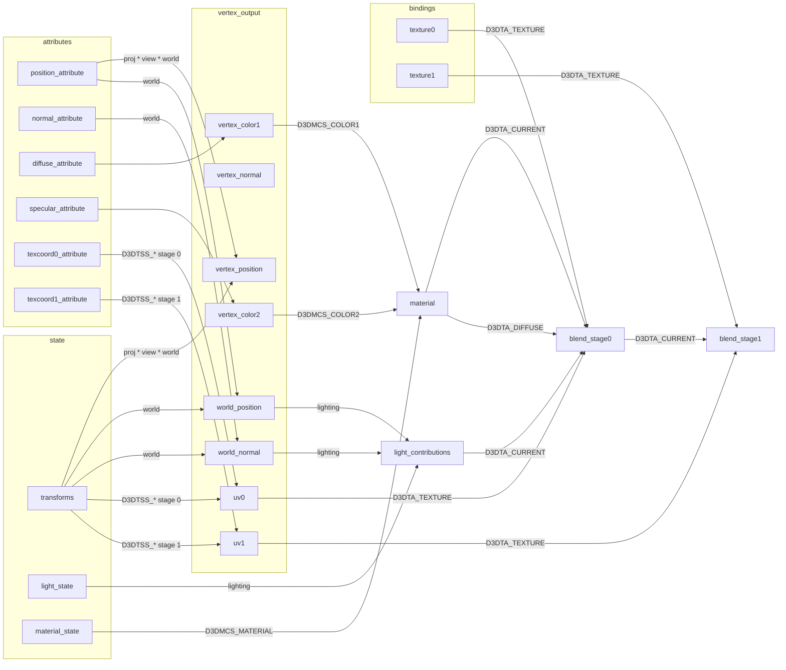

# Rendering Notes

A few notes I've made while debugging the new WGPU render backend.

You may also be interested in the original .txt files in the `Code/ww3d2/` directory,
but they're fairly obscure to start. I'll reference them where appropriate..

## Components

The original code is in `Code/`, where `ww*/` directories are the generic libraries that were
presumably shared between projects. My new Rust code is in `Crates/`, and my dummy external
libraries are in `MockedSdks/`, which get the code building without updating the original
code as much as possible.

The parts we care about are:

- `Code/Commando/` - the root executable, it tracks the top-level game modes, menus etc., so
  we mostly only care about the main game loop dispatching to the other parts here. The rendering
  options will be more relevant later.

- `Code/Combat/` is the main combat game mode, I haven't much looked at this yet. It forwards
  all the fancy rendering to the `PhysicsSceneClass` in `Code/wwphys/` (not actually a physics
  scene in the modern sense as far as I understand)

- `Code/wwphys/` is a generic 3d world game engine. Probably the most interesting part for
  later. Collisions, pathfinding, physics, vehicles, actors, and visual effects logic; that sort
  of thing.

- `Code/ww3d2/` is general 3D rendering wrapper. It mostly handles state management and abstracts
  the underlying Direct3D 8 rendering API: managing materials, meshes & texture loading, cameras,
  scenes etc.

- `MockedSdks/D3D8/` is my stubbed out Direct3D 8 API. It's just enough filled out so the original
  code compiled, and is progressively being filled out to forward to `Crates/Render/`

- `Crates/Render/` is my new Rust crate to perform rendering which is currently just a WGPU thin
  wrapper. I'll be moving a lot more of the rendering logic in here once things are working better.

## High level

Renegade's rendering starts in `_Game_Main_Loop_Loop()` in `mainloop.cpp`, when it
calls `GameModeManager::Render()`.

This does some checks to see if rendering is enabled (e.g. not a dedicated server),
then:

- If in combat mode, updates the `PhysicsSceneClass` before rendering.
- Calls `WW3D::Begin_Render()`:
    - This does some bookkeeping and pumps the texture loading queue.
    - Then clears the screen, then calls `IDirect3DDevice::BeginScene()` which i've
      mapped to `wgpu_commands_begin_render_pass()`
- Then, if the game is in focus, iterates `GameModeList`, and calls `Render()` on each that are not "inactive".

  The modes are all added to the `GameModeManager` in `Game_Init` in `Commando`. They implement
  an activation lifecycle, and a `Think` and `Render` method. They are mostly surprisingly simple,
  the system seems a bit vestigial.

  These modes are, in order (these are the names used to look them up, the class names append `GameModeClass`):
    - `Combat` - the actual gameplay - renders a `PhysicsSceneClass`
    - `LAN`, `WOL` - network, no rendering
    - `Overlay` - renders a `SimpleSceneClass`, mostly used for the menu background?
    - `Menu` - no rendering! just plays music
    - `Movie` - plays BINK movies
    - `Console` - no rendering, forwards input to a dev console
    - `ScoreScreen` - forwards to the dialog system to show `ScoreScreenDialogClass` on init
    - `TextDisplay` - wraps `Render2DTextClass` to act as a text layer
    - `Overlay3D` - another `SimpleSceneClass` renderer like `Overlay`, unused
- It then explicitly calls render for:
    - `CombatManager::MessageWindow`
    - `ObjectiveMananger::Viewer`
    - `DialogMgrClass`
    - `cDiagnostics`
    - `BINKMovie`
- Then `WW3D::End_Render()`:
    - This calls `SortingRendererClass::Flush()` which draws any queued any queued up triangles.
    - Then calls `DX8Wrapper::End_Scene()` which calls:
        - `IDirect3DDevice::EndScene()` which I've mapped to `wgpu_device_submit()` (which implicitly ends the render
          pass)
        - `IDirect3DDevice::Present()` which I've mapped to `wgpu_surface_present()`

## D3D Fixed Function Pipeline

The original code uses the Direct 3D fixed function pipeline, which is rather hard to put together from the Microsoft
docs.

### Inputs

`SetVertexShader()` takes an "FVF" (Fixed Vertex Function) that defines which predefined vertex attributes exist,
their layout, and the default behavior. It's mostly a set of bits or-ed together for each attribute, the used ones are:

- `D3DFVF_XYZ` - 3 floats for position
- `D3DFVF_XYZB4` - 3 floats for position, and 4 floats for blend weights
    - unless `D3DFVF_LASTBETA_UBYTE4` is also set, then instead of the last float being a blend weight, it's a blend
      weight index
    - this is `D3DFVF_XYZ` or-ed with what I've defined as `D3DFVF_B4`, though it's not legal to provide only that.
- `D3DFVF_NORMAL` - 3 floats for normal
- `D3DFVF_DIFFUSE` - 4 bytes for the diffuse color (as a D3DCOLOR, e.g. `0xAARRGGBB`)
- `D3DFVF_SPECULAR` - 4 bytes for specular color
- `D3DFVF_TEX1` - 2 floats for the first texture coordinate (can be up to 4 in general only 2 used in Renegade)
- `D3DFVF_TEX2` - 2 floats for the second texture coordinate

`SetTransform()`, `SetRenderState()`, `SetTextureStageState()`, `SetLight()`, `LightEnable()`, and `SetMaterial()`
all set inputs to the state block describe below, effectively the uniforms for the fixed function pipeline, though some
render states are pipeline state (blend modes), and some texture stage states are texture sampler state (e.g. filtering
and wrapping)

`SetStreamSource()` binds the vertex buffer (only one), `SetIndices()` binds the index buffer, `SetTexture()` binds a
texture to a stage. Note that in DX8, `SetIndices()` sets the current vertex offset, it's not a `Draw` parameter (that
was one of the few DX9 breaking changes).

`DrawIndexedPrimitive()` is the actual draw call (renegade always uses indices), using the current state block and
bindings.

### Per-vertex

Computes the following properties:

- position, based on the vertex position attribute and the `D3DTS_{VIEW,PROJECTION,WORLD}` transforms
- normal, based on the vertex normal attribute and the `D3DTS_WORLD` transform, or all 0 if not provided
- computes the uv coordinates for each texture stage (2 in Renegade) base on the states:
    - `D3DTSS_TEXCOORDINDEX` - which vertex attribute to use for the texture coordinates, e.g. 0 or 1 selects the first
      or second UV, while `D3DTSS_TCI_CAMERASPACEPOSITION` uses the "camera space" (applying the view and world matrix)
      position
    - `D3DTSS_TEXTURETRANSFORMFLAGS` - how to transform the selected texture coordinates: Renegade uses:
        - `D3DTTFF_DISABLE` means to use the vertex attribute directly
        - `D3DTTFF_COUNT2` means to apply the stages' texture matrix to the first two coordinates.
        - `D3DTTFF_COUNT3 | D3DTTFF_PROJECTED` means to apply the stages' texture matrix to the first three coordinates,
          then divide the first two by the third (projective divide)
- Traditionally, compute lighting based on the enabled lights and the vertex world position and normal. See lighting
  below. Currently just forwards the diffuse and specular colors, and the world position and normal for lighting to
  be computed per pixel. Should fallback colors based on `D3DMCS_*` if not provided, but that doesn't seem to be used
  so I haven't implemented it.

### Per-pixel

Applies interpolated values from the vertex shader, then applies texture blend states. Each texture stage can define
one of a set of math operations to apply to two arguments, each of which can be selected. Generally one will be
"current", which is either the previous stage's output or the diffuse color, and the other will often be a texture
sample. Renegade often uses this to multiply the diffuse color by a diffuse texture sample, the multiply by a lightmap
texture.

### Lighting

Lighting is rather odd, as it is computed separately per material property! In the fixed function pipeline, a resolved
material has an ambient, diffuse, specular, and an emissive color. Each of these are selected initially based on
`D3DMCS_*` values for `D3DTSS_{AMBIENT,DIFFUSE,SPECULAR,EMISSIVE}MATERIALSOURCE` texture stage states:

- `D3DMCS_MATERIAL` means to use the material property from `SetMaterial()` for the component, e.g. the computed
  diffuse color comes from the material `Diffuse` property.
- `D3DMCS_COLOR1` means to use the color from the "diffuse" vertex attribute, regardless of which material property
  is being computed.
- `D3DMCS_COLOR2` means to use the color from the "specular" vertex attribute, regardless of which material property
  is being computed.

Then if `D3DRS_LIGHTING` is enabled, a total light contribution is computed for the ambient, diffuse, and specular
components (emissive is not effected by lighting), with ambient getting an additional global value set by
`D3DRS_AMBIENT_COLOR`. Per light in range, a contribution factor is computed based on the attenuation and spotlight
factors as appropriate for the type, which is multiplied by each material property:

- Ambient is simply multiplied by the contribution
- Diffuse is further multiplied by the dot product of the light's direction (globally for directional lights, or
  the relative direction from the light position to surface position) and the surface normal (in world space).
- Specular is instead multiplied by the the dot product of the surface normal and the "halfway" vector between
  the light and view direction (in world space), raised to the power of the material's `Power` property. (This should
  be equivalent to using the dot product of the view and reflection vectors.)

### Graph

This overview graph might help, even if it's somewhat incomplete:

## Materials

Mostly defined by `Code/ww3d2/shader.cpp`.

TODO

## Asset loading

TODO
